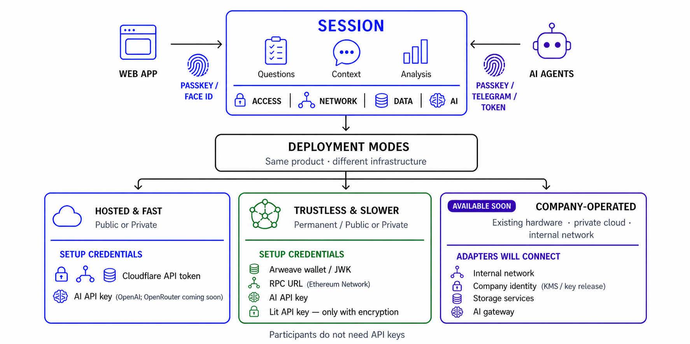
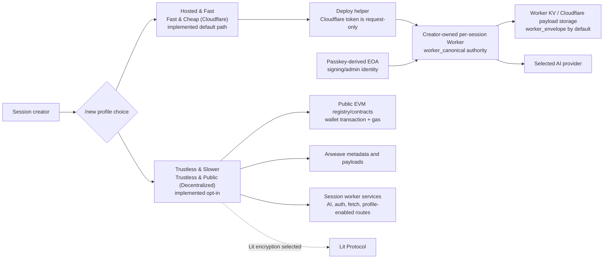
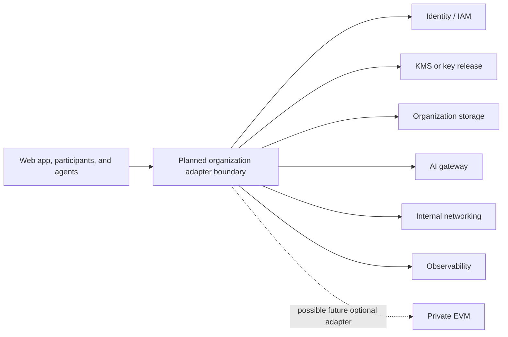

# Context Engine — Architecture

> Single-page system overview. For detailed specs see [`spec.md`](spec.md) and [`docs/`](docs/README.md).

## Deployment Profiles



App hosting, public/private session access, and session infrastructure are
separate choices. A publicly hosted web app can open either a private
worker-canonical session or a public decentralized session. The `/new` chooser
opens with no preset automatically selected; Hosted & Fast is the implemented
default/recommended path once chosen.

### Implemented Profiles



Hosted & Fast needs a creator Cloudflare API token and one AI-provider key. Its
passkey-derived EOA signs the canonical worker config but does not submit an EVM
transaction; public EVM, registry, RPC, gas, Arweave, and Lit are not default
dependencies. Trustless & Slower preserves the public EVM, Arweave, wallet, and
gas path as an opt-in profile. Lit credentials are required only when Lit
encryption is selected.

Participants use session identity and authorization. They never need the
creator's Cloudflare token, AI key, Arweave key, or other deployer API keys.

### Company-Operated (planned)



Company-Operated is a target for existing hardware, private clouds, and internal
networks; these adapters and a packaged corporate edition are not generally
available. The target can be entirely off-chain. A private EVM may be explored
as an optional compatibility adapter, but it is not required by this
architecture.

## Layer Descriptions

| Layer | What it does | Profile role | Primary location |
|-------|-------------|--------------|-----------------|
| **Client** | React SPA: survey authoring, response collection, SBT management, encryption gates, admin, session wizard | Shared across implemented profiles | `client/src/` |
| **Session Worker** | Auth, canonical config, AI proxy, transcription, storage/fetch routes, and profile-enabled chain/Arweave helpers | Canonical authority for Hosted & Fast; service boundary for decentralized/custom profiles | `workers/sessionCorsWorker/` |
| **Cloudflare storage** | Worker KV config, secrets, encrypted payload envelopes/indexes, and optional advanced R2 blobs | Hosted & Fast default | Worker bindings (external) |
| **Contracts** | Session registry, surveys, SBTs, gates, and factory on supported EVM chains | Trustless & Slower and explicit chain-backed custom profiles | `contracts/` |
| **Arweave** | Immutable metadata, survey/question payloads, SBT tokenURI, and document-library files | Trustless & Slower and explicit Arweave-backed custom profiles | External |
| **Lit Protocol** | Client-side encrypt/decrypt with EVM access-control conditions | Optional when Lit encryption is selected | External SDK |
| **Organization adapters** | IAM, key release/KMS, storage, AI, networking, and observability | Planned Company-Operated profile; not shipped | Future adapter boundary |

## Data Flows

### 1. Session Creation (`/new`, canonicalized to `/session/new`)

Hosted & Fast:

```text
Wizard UI  ──▸  Deploy creator-owned per-session Worker (via deploy-helper)
           ──▸  Seed Worker secrets and Cloudflare storage bindings
           ──▸  Persist and read back admin-signed canonical Worker config
           ──▸  Return reload-safe session/admin URLs with the public Worker URL

No Arweave upload, registry write, RPC call, gas payment, or EVM transaction.
```

Trustless & Slower:

```text
Wizard UI  ──▸  Configure profile-enabled session Worker services
           ──▸  Upload metadata JSON to Arweave (optionally Lit-encrypted)
           ──▸  SessionRegistry.createSession(slug, sessionId, chainId, metadataURI)
           ──▸  SessionRegistry.setSessionFields(slug, [corsWorkerUrl, sponsored_*])
           ──▸  SessionRegistry.setResourceGates(slug, gates[])
```

Sponsored bootstrap deploys now target the sponsoring `sessionCorsWorker` first:

```
Browser  ──▸  source sessionCorsWorker /sponsored/redeem-deploy
         ──▸  embedded deploy-helper core inside source worker
         ──▸  fallback standalone deploy-helper only if embedded deploy is disabled or retryable failure occurs
```

### 2. Survey Response

```text
User submits  ──▸  Store the payload through the profile-selected backend
               ├─ Hosted & Fast: Cloudflare storage, worker-envelope by default
               └─ Trustless & Slower: Arweave, with Lit only when selected

Chain-backed survey flows may additionally anchor selected response hashes
through Surveys.submitResponses(...). That contract write is profile/surface
specific rather than a universal storage dependency.
```

### 3. SBT Mint (chain-backed profiles)
```
User claims ──▸  CustomSBT.mint() / .claimWithPassword() / .claimWithSignature()
            ──▸  Token metadata stored on Arweave (via SBTFactory or direct)
```

### 4. Gate Check (Worker Login)

```text
Client ──▸  POST /auth/nonce { address, sessionSlug }
       ──▸  Sign the worker login message
       ──▸  POST /auth/login { address, message, signature, sessionSlug }

Hosted & Fast: worker-canonical roles/groups determine scopes; no registry read.
Trustless/custom chain gates: Worker reads SessionRegistry gates and selected
SBT balances before issuing scoped access.
```

### 5. Encryption / Gated Decrypt

```text
Hosted & Fast default:
  Worker encrypts payloads at rest with worker-envelope keys
  Worker roles/conditions gate future key release

Lit opt-in:
  Client encrypts with Lit access conditions
  Lit nodes evaluate the selected EVM conditions before client-side decrypt
  Arweave or Cloudflare stores the resulting ciphertext according to the profile
```

## Corpus Data

- `ai-discourse-corpus/` is a tracked top-level dataset with reusable JSON sub-corpuses covering AI policy, safety research, technical evaluations, science fiction, debates, practitioner interviews, and enriched social-media discourse.
- The corpus is kept outside the client so it can be versioned and reused independently of the client demo runtime.

## Key File Map

### Client (`client/src/`)

| Area | Files |
|------|-------|
| Entry / routing | `components/MainSite/AppShell.tsx` |
| Home tab shell | `components/MainContent/MainAreaTabs.tsx`, `ToolExplorer.tsx`, `OnboardingWalkthrough.tsx` |
| Account / login settings | `components/Account/LoginAndSettingsModal.tsx`, `LoginButton.tsx` |
| Session wizard | `components/Sessions/SessionWizard.tsx` |
| Session page shell | `components/OnePageSession/OnePageSession.tsx` |
| Demo-only views | `components/DemoViews/DemosIndex.tsx`, `RiskMatrixDemo.tsx`, `CorpusViewer.tsx`, `components/DemoViews/DemoAnalysis/`, `components/DemoViews/DebateHUD/` |
| Document library | `components/DocumentLibrary/SessionDocumentsPage.tsx`, `DocumentLibraryPanel.tsx` |
| Admin | `components/Admin/AdminPage.tsx` |
| About page | `components/About/AboutPage.tsx` |
| Survey tool | `components/SurveyTool/SurveyTool.tsx`, `CreateQuestionsAndSurveys.tsx`, `SurveyResults.tsx` |
| Shared UI | `components/Shared/AudioInput/AudioInput.tsx`, `components/Shared/Json/JsonControls.tsx`, `components/Shared/Json/JsonDisplay.tsx` |
| SBT management | `components/SBTs/SBTsList.tsx`, `SBTPage.tsx`, `CreateSBTGroup.tsx` |
| Gate components | `components/Gates/` |
| **Utilities** | |
| Web3 / contracts | `utilities/web3/chainGateway.ts`, `contractScripts.impl.ts`, `contractHelpers.ts`, `chainEventStreams.ts`, `profileChainReads.ts`, `sessionRegistry.ts` |
| Wallet | `client/src/wallet/` passkey EOA wallet config, encrypted keystore, EIP-1193 provider, and soft-session worker |
| Crypto / Lit | `utilities/crypto/litProtocol.ts`, `cryptography.ts`, `encryptedFields.ts` |
| Arweave | `utilities/arweave/arweaveClient.js`, `arweaveUrls.ts` |
| Session helpers | `utilities/session/sessionNaming.ts`, `sessionMetadata.ts`, `resourceKeys.ts`, `sessionModeProfile.ts`, `groupCreationPolicy.ts`, `sessionBackendKind.ts`, `agentClientLogin.ts`, `telegramAgentData.ts`, `telegramSessionBackend.ts` |
| Worker auth | `utilities/worker/workerAuth.ts`, `corsProxy.ts` |
| Cache | `utilities/cache/cacheScripts.ts`, `storageManager.ts` |
| AI | `utilities/ai/aiClient.js`, `aiSettings.ts` |
| Survey logic | `utilities/survey/questionRouting.ts`, `filterStateUtils.ts`, `compareUsers.ts` |
| **Config / variables** | |
| Feature flags | `variables/appConfig.ts` |
| Chain config | `variables/chains.ts` |
| Session fallback | `variables/demo/demo_sessions.json` |

### Contracts (`contracts/`)

| Contract | Purpose |
|----------|---------|
| `SessionRegistry.sol` | Session registry, resource gates (Any/All SBT rules), metadata URI pointers |
| `Surveys.sol` | Survey/question registration and response hash anchoring. Explicit existence state preserves `bytes32(0)` as the absence sentinel; zero IDs, zero content/response hashes, and mismatched optional survey-response pairs revert. |
| `CustomSBT.sol` | Non-transferable ERC-721 (SBT) with ERC-5192 / ERC-5484-aligned lock + burn-auth surfaces, password/invite/signature mint paths, `SBTActivity` history events, and `getHistorySummary()` for count-only reads. Transfers, approvals, and `safeTransferFrom` revert with `Soulbound()`. |
| `SBTFactory.sol` | Deploys new CustomSBT instances (optionally deterministic via CREATE2). Configured deterministic deployments require the transaction sender to be the configured SBT admin. |

### Workers (`workers/`)

| Worker | Purpose |
|--------|---------|
| `sessionCorsWorker/worker.js` | Canonical config/auth/storage for Hosted & Fast, plus profile-enabled AI, Arweave, fetch, transcription, and faucet routes |
| `deploy-helper/worker.js` | One-click worker deployment from the session wizard |

### Verification

Public unit and integration coverage lives beside client source and under
`tests/root/`. Supported public commands are documented in `docs/testing.md`.

## Contract Addresses

Contracts are chain-agnostic EVM Solidity. Deployments are configured per chain in `client/src/variables/chains.ts` (`SESSION_REGISTRY_ADDRESSES`, `SESSION_CONTRACTS_BY_CHAIN`).

| Chain | SessionRegistry | Surveys | SBTFactory |
|-------|----------------|---------|------------|
| OP Sepolia (11155420) | `0xDcB1731984E9F75c6a061c38dD8b67d18De4C0c1` | `0x59664B9dA510a33F2edB7E14Cf0c2749bf506B8A` | `0x8CBeE1EE46603b446b499cb32F63fa9860a50478` |
| Base Sepolia (84532) | `0xD55Aa8fb29964d034d59B90DFFD23790f7B34B00` | `0xcccb5c1a96b3e10f395e318ae75db24e45bd3808` | `0x538A48BC439A36D2A86e63114DCD9c429d2ddEcA` |

The listed immutable Surveys and SBTFactory deployments predate the current
source hardening. The restrictions above become live only after a testnet
redeploy and corresponding address/transaction updates; no mainnet migration is
in scope.

CustomSBT instances are deployed per-group via SBTFactory. Configured
deterministic SBT creation is admin-submitted; sponsored or relayed configured
creation requires a separate authorization design.

The current OP Sepolia `SBTFactory` default above was deployed in tx
`0x57b91018ed6b93f64c83d5a44bfb9d0be1920f96929ecc045aa3946ba7cc917e`.

The legacy Base Sepolia `SBTFactory` default above was deployed in tx
`0x4a0428a0fe6d6090fd6112885ea46b30ff84a1a551d0806c0f9afda4b44a5f21`.

To add a new chain: deploy contracts, add entries to `SESSION_REGISTRY_ADDRESSES` and `SESSION_CONTRACTS_BY_CHAIN` in `chains.ts`, and add the chain definition to the chain registry.

### Address Discovery

Contract address discovery is currently file-based rather than on-chain.
`client/src/variables/chains.ts` imports the base deployment map from `contracts.json`.
`SESSION_REGISTRY_ADDRESSES` maps each supported chain ID to its `SessionRegistry` address.
`SESSION_CONTRACTS_BY_CHAIN` provides the per-chain contract configuration used by the SPA.
That bundle includes addresses such as `SessionRegistry`, `Surveys`, and `SBTFactory`.
For local development, `local-contracts.json` can override the checked-in defaults.
Those local overrides are merged into both exported maps before the client reads them.
This is the current source of truth for contract lookup in the client.
There is no dynamic production discovery step today.
The planned future path is ENS-based discovery via `<chainId>.contracts.contextengine.eth`.
That ENS lookup is not implemented yet.

## Auth Model

```text
Client  ──▸  POST /auth/nonce { address, sessionSlug }
        ◂──  nonce
        ──▸  sign login message with passkey-derived EOA or wallet
        ──▸  POST /auth/login { address, message, signature, sessionSlug }

Worker verifies signature, then evaluates profile-specific authorization:
  Hosted & Fast       -> worker-canonical roles/groups and session config
  Trustless/custom    -> selected SessionRegistry gates and SBT balances

Worker  ──▸  { token, exp } with session-scoped permissions + config epoch
Client  ──▸  authenticated Worker requests with Authorization: Bearer <token>
```

Worker-canonical login does not query an EVM registry. Chain reads occur only
when the selected profile uses on-chain authorization. Login tokens use a
base64url payload plus HMAC, expire after four hours, and have a same-TTL
`authToken:{slug}:{sub}:{jti}` KV marker. Before protected route side effects,
the Worker also requires the token's server-managed authorization epoch to
match current config and re-evaluates the current default plus route-specific
gate. Registry gate changes therefore take effect on the next request; config
changes invalidate previously issued tokens. The mandatory Session coordinator
Durable Object serializes nonce issue/consume and per-route counters across
isolates; KV nonce markers are diagnostic mirrors only.

## Session Config Data Shape

Config authority follows the selected session profile:

| Store | Profiles | Authority | Shape docs |
|-------|----------|-----------|-----------|
| **Worker KV** (`session:{slug}:config`) | Hosted & Fast; worker-backed custom profiles | Canonical identity/content for `worker_canonical`; operational config for other worker-backed profiles | [`docs/session-cors-worker.md`](docs/session-cors-worker.md) |
| **Worker KV** (`session:{slug}:secrets`) | Worker-backed profiles | AI keys and only the profile-enabled runtime credentials; never public config | [`docs/session-cors-worker.md`](docs/session-cors-worker.md) |
| **SessionRegistry** (on-chain) | Trustless & Slower; explicit registry profiles | Session identity, metadata pointer, admin, gates, sponsored flags | [`docs/session-registry.md`](docs/session-registry.md) |
| **Arweave metadata** | Trustless & Slower; explicit Arweave profiles | Durable content, UI defaults, contracts, and selected encryption metadata | [`docs/session-registry.md` §Arweave](docs/session-registry.md) |

See [`docs/session-registry.md`](docs/session-registry.md) for the decentralized
metadata schema and [`docs/session-cors-worker.md`](docs/session-cors-worker.md)
for canonical Worker config, secrets, and storage bindings.

## Storage Model

```text
Hosted & Fast (implemented default)
───────────────────────────────────
Per-session Worker
  session:{slug}:config       canonical identity/content and policy
  session:{slug}:secrets      AI and profile-enabled runtime secrets
  Cloudflare storage routes   encrypted payload envelopes and indexes in KV
                              optional existing R2 for advanced blob storage
  passkey-derived EOA         signing/admin identity; no required chain tx

Trustless & Slower (implemented opt-in)
────────────────────────────────────────
SessionRegistry / Surveys / SBTs   public identity, gates, hashes, membership
Arweave                            metadata, payloads, tokenURI, documents
Public EVM                         wallet transactions, gas, contract reads
Lit (optional)                     selected EVM access conditions and decrypt

Company-Operated (planned)
──────────────────────────
Organization-selected IAM, key release/KMS, storage, AI, networking, and
observability adapters. Public EVM and Arweave are not architectural
requirements; a private EVM would be an optional future adapter.
```

## Further Reading

- [`spec.md`](spec.md) — Full feature specification
- [`docs/session-registry.md`](docs/session-registry.md) — On-chain registry + Arweave metadata schema
- [`docs/session-cors-worker.md`](docs/session-cors-worker.md) — Worker endpoints, KV layout, auth flow
- [`docs/arweave-payloads.md`](docs/arweave-payloads.md) — Arweave payload shapes
- [`docs/path-rpc.md`](docs/path-rpc.md) — PATH/provider ordering and overrides
- [`docs/rpc-scan-scope.md`](docs/rpc-scan-scope.md) — scan-scope and profile-scan guardrails
- [`docs/cache/README.md`](docs/cache/README.md) — managed cache backend + namespace guide
- [`docs/lit-protocol-information.md`](docs/lit-protocol-information.md) — Lit Protocol integration
- [`docs/resource-keys.md`](docs/resource-keys.md) — Resource key resolution
- [`docs/passkey-wallet.md`](docs/passkey-wallet.md) — passkey EOA wallet
- [`docs/forking-wallet.md`](docs/forking-wallet.md) — fork-owned RP ID setup
- [`docs/security-model.md`](docs/security-model.md) — embedded wallet security model
- [`docs/local-chain.md`](docs/local-chain.md) — Local Anvil development
