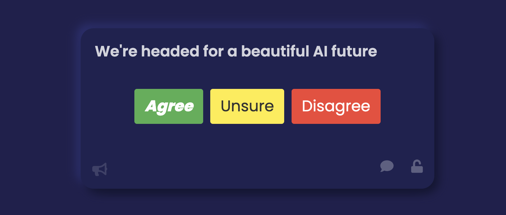

# Context Engine


<p align="center">
  
</p>

**Live demo:** [contextengine.xyz](https://contextengine.xyz)


Context Engine is a toolkit for AI-enhanced deliberation and sensemaking in large groups. It supports public and private questions and responses, AI-assisted input and analysis, permanent records, and cryptographic access control. It allows for no-code deployment of [SBT Groups](https://www.radicalxchange.org/wiki/social-identity/). Designed for use cases such as public discourse, organizational decision-making, and preference-related dataset creation.


## Quick Start

### Prerequisites
- Root scripts, worker bundling, and contract tooling: Node.js 20+
- Client workflows: Node.js 16.14.2 and npm 9.2.0
- Foundry (`forge` / `anvil`) for local-chain and root contract test workflows

### Clone and Install

```bash
git clone https://github.com/AgalmicSoftware/context-engine.git
cd context-engine

nvm use 20
npm install

cd client
nvm use 16
npm install
npm run dev
```

The React app runs on `http://localhost:3000`.

For testing, run modes, and deeper setup:
- [docs/testing.md](docs/testing.md)
- [docs/run-modes.md](docs/run-modes.md)
- [docs/session-creation-guide.md](docs/session-creation-guide.md)

## Features

### Survey and Response Management
- Multiple question types: freeform, multiple choice, binary, and rating scales
- Optional encryption responses and results
- Decentralized and permanent storage of responses
- Statistical analysis and visualization
- Export results as `.json` and `.csv`

### SBT-Gated Groups
- No-code creation of Soulbound tokens ([SBTs](https://www.radicalxchange.org/wiki/social-identity/)) for groups
- Public minting, password-protected minting, and auto-claim URLs
- Role-based burn authorization
- Session and resource gating based on SBT ownership

### AI-Assisted Tooling
- Voice-to-text 
- Question generation from URL or text input
- Summaries and analysis of survey results and response clusters
- OpenAI, Anthropic, OpenRouter, and custom provider paths 


## AI Discourse Corpus

The top-level [`ai-discourse-corpus/`](ai-discourse-corpus/) directory contains reusable JSON sub-corpuses curated from AI policy, safety, governance, science fiction, practitioner interviews, evaluation work, debates, and enriched social-media discussion. Rights for that directory are described separately in [ai-discourse-corpus/LICENSE.md](ai-discourse-corpus/LICENSE.md): no ownership is claimed over upstream source material, and project-authored annotations are dedicated under CC0.

## Scaling

The default public deployment supports hundreds to low thousands of concurrent participants per session. For larger deployments, see [docs/scaling.md](docs/scaling.md).

## Documentation

- Project framing: [Whitepaper/whitepaper.md](Whitepaper/whitepaper.md)
- System design, data flows, and file map: [ARCHITECTURE.md](ARCHITECTURE.md)
- Docs index: [docs/README.md](docs/README.md)
- Testing guide: [docs/testing.md](docs/testing.md)
- Run modes: [docs/run-modes.md](docs/run-modes.md)
- Public client config and current defaults: [docs/public-client-config.md](docs/public-client-config.md)
- PATH / RPC behavior: [docs/path-rpc.md](docs/path-rpc.md)
- Session creation, worker setup, and Arweave JWK workflow: [docs/session-creation-guide.md](docs/session-creation-guide.md)
- Cloudflare worker docs: [docs/session-cors-worker.md](docs/session-cors-worker.md)
- Session registry and gate model: [docs/session-registry.md](docs/session-registry.md)
- Scaling reference: [docs/scaling.md](docs/scaling.md)
- Public roadmap: [ROADMAP.md](ROADMAP.md)

## Licensing

This repo is intentionally multi-license. The main client/app OSS surface in `client/` remains `CPAL-1.0`. The worker subtree under `workers/` is `MIT`, and third-party worker dependencies and tooling keep their own licenses. The project-authored annotations in [`ai-discourse-corpus/`](ai-discourse-corpus/) are dedicated under CC0; see [ai-discourse-corpus/LICENSE.md](ai-discourse-corpus/LICENSE.md). See [LICENSING.md](LICENSING.md) for the current boundary map and shared-file rules.

## Roadmap

Known limitations and future development directions live in [ROADMAP.md](ROADMAP.md).
