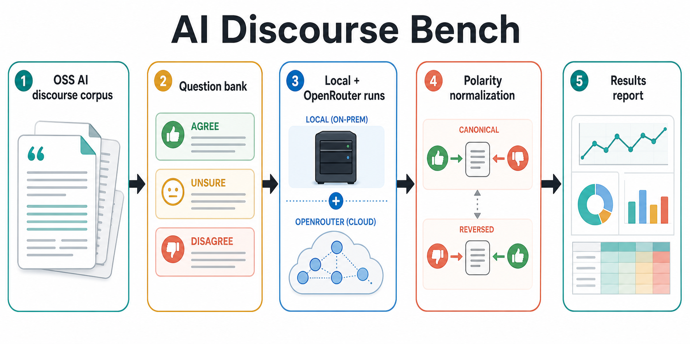
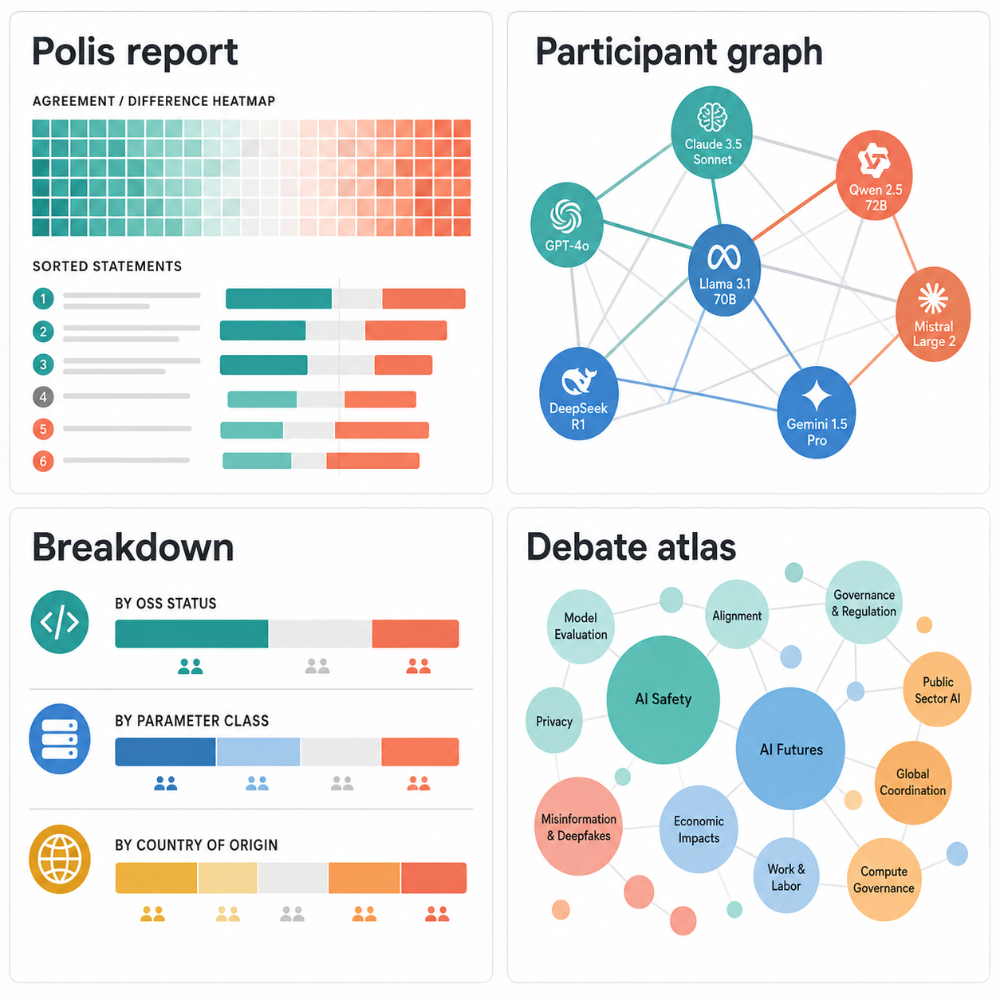

# AI Discourse Bench

AI Discourse Bench maps how AI models agree, disagree, remain uncertain, and
shift under reversed wording across a broad bank of AI discourse questions.

This is a self-contained benchmark folder inside Context Engine. It uses the
OSS `ai-discourse-corpus/` as the source substrate for question generation, then
renders results in a Context Engine-style report shape.

The benchmark is descriptive, not a model leaderboard. Each model is one
participant; repeated generations are nested measurements of that participant.
See [docs/methodology.md](docs/methodology.md) for aggregation, similarity,
coverage, release, persona, and analysis-provenance rules.

## What It Measures

- Model agreement and disagreement over AI discourse questions, starting with
  AI policy and AI futures.
- Similarity and difference between model answer profiles.
- Polarity sensitivity by asking canonical and reversed versions of each
  question.
- Trait-level breakdowns by model metadata such as parameter class, OSS status,
  country of origin, and provider class.
- Weights-only persona mode, where models predict how a named public historical
  or contemporary figure would answer using only knowledge in model weights.
- Optional quadratic importance allocation, where every model receives the same
  credit budget and pays `votes^2` to prioritize questions. These allocations
  control Debate Map prominence without changing stance results.

## Result Views

- **Publication introduction:** a persistent Context Engine: AI Opinions Benchmark
  explainer above Results identifies the OSS corpus basis, current topic, run
  counts, response mode, and repeat depth. The current selector contains the AI
  Futures & Policy track; the report contract supports additional topic-specific
  banks without changing the Results views. Preview reports are marked `noindex`.
- **Polis report:** question-level and model-level agreement/disagreement,
  including a beeswarm-style consensus/difference view.
- **Participant graph:** models as participant nodes positioned by opinion
  profile similarity, with similarity/difference edges.
- **Breakdown view:** collapsible model cohorts by traits.
- **Debate atlas:** deterministic topic circles by default, or AI-generated
  topic circles and compasses when a second-pass overlay is supplied.
- **Participants list:** the participants are the tested models, not human
  wallets or session responders.
- **Raw Results:** collapsible aggregate report, Context Engine import, and
  second-pass analysis JSON. Raw provider responses stay in the separate run
  artifact for answer-level audit and reproducibility.

## Diagrams





## Quick Start

```bash
cd ai-discourse-bench
npm run smoke
```

The smoke path uses the deterministic mock provider and does not require network
or API keys. It writes ignored local artifacts under `runs/` and `results/`,
including `results/mock-self-report.html` and
`results/mock-self-ce-polis-export.json`.

The checked-in development seed bank has 200 questions across 20 topics. It is
not yet a validated benchmark release. Regenerate it
from the corpus-grounded topic packs with:

```bash
npm run generate:questions
```

The recommended runnable bank is the source-resolved, AI-audited 50-question
candidate:

```bash
npm run build:candidate-bank
npm run build:reviewed-candidate-bank
```

The second command writes
`banks/ai-futures/v0.2-reviewed-candidate/question-bank.json`, its manifest,
and an item-level audit. The bank covers all 20 topics and every question
resolves to concrete evidence in the OSS corpus. The AI-assisted audit accepted
42 wording pairs and revised 8. It remains `candidate`, not `validated`, until
two independently recorded human reviews approve claim support, reversal
quality, and single-axis status. The two reviews are defined as: (1) an
author-side review recorded without model outputs displayed or consulted, and
(2) an external reader's review conducted blind to model outputs and
independently of the author's judgment. Unresolved disagreement leaves the
item at `candidate`.

Before launching calls, inspect the experiment plan:

```bash
node ./bin/ai-discourse-bench.mjs plan-run \
  --questions ./banks/ai-futures/v0.2-reviewed-candidate/question-bank.json \
  --models ./data/model-roster.sample.json \
  --repeats 10
```

The plan reports exact calls, deterministic token estimates, configured
credentials/endpoints, structured-output mode, and cost when roster pricing is
available.

## Local Models

Run against an OpenAI-compatible local server:

```bash
AIDB_LOCAL_BASE_URL=http://127.0.0.1:8000/v1 \
node ./bin/ai-discourse-bench.mjs run \
  --provider local \
  --questions ./banks/ai-futures/v0.2-reviewed-candidate/question-bank.json \
  --models ./data/model-roster.sample.json \
  --out ./runs/local-self-runs.json \
  --repeats 10 \
  --concurrency 2 \
  --max-attempts 3
```

If your local server requires a key, set `AIDB_LOCAL_API_KEY`.
The runner writes a JSONL checkpoint beside the output. Re-run the same command
with `--resume` after an interruption; deterministic run ids prevent completed
model/question/polarity/repeat cells from being launched again.

`data/model-roster.local-environment.json` records the five local model
participants used by the checked-in development preview, including quantization
and runtime provenance but no machine paths or credentials. Use it as the
combined roster when rebuilding the five-model report.

Run the 50-question candidate bank with 10 canonical runs and 10 reversed runs
per model:

```bash
AIDB_LOCAL_BASE_URL=http://127.0.0.1:8000/v1 \
AIDB_QUESTION_BANK=./banks/ai-futures/v0.2-reviewed-candidate/question-bank.json \
AIDB_LOCAL_MODELS="llama3.1:8b|Llama 3.1 8B|8B|open-weights|US,qwen2.5:14b|Qwen 2.5 14B|14B|open-weights|China" \
npm run local:full
```

This writes:

- `runs/local-self-runs.json`
- `runs/local-self-model-roster.generated.json`
- `results/local-self-report.json`
- `results/local-self-report.html`

For two models, the default run count is `50 questions * 2 polarities * 10
repeats * 2 models = 2000` local model calls. Set `AIDB_REPEATS` only for a
short dry run; leave it unset for the benchmark default of 10.

For a fast wiring check against real local models, limit the bank:

```bash
AIDB_LIMIT_QUESTIONS=5 AIDB_REPEATS=1 AIDB_MAX_TOKENS=700 npm run local:full
```

`local:full` also accepts `AIDB_CONCURRENCY`, `AIDB_MAX_ATTEMPTS`,
`AIDB_SCHEDULE_SEED`, and `AIDB_RESUME=1`.

After aggregating a report, generate a response-based question audit with:

```bash
npm run evaluate:questions -- \
  --report ./results/environment-seed200-five-local-r10-report.json \
  --reviewed-bank ./banks/ai-futures/v0.2-reviewed-candidate/question-bank.json \
  --out ./results/environment-seed200-five-local-r10-question-evaluation.json \
  --csv ./results/environment-seed200-five-local-r10-question-evaluation.csv
```

The audit separates reliability problems (coverage, invalid responses, repeat
stability, and wording sensitivity) from useful consensus and useful
between-model disagreement. It also reports the bank-wide raw agreement gap
between canonical and reversed wording to expose directional framing or
acquiescence effects, and flags reversal pairs with unusually low content-word
overlap or risky negation scope for direct adjudication. Its recommendations
are triage inputs for human review, not automatic inclusion or exclusion
decisions. The JSON records a deterministic hash of the aggregate report and,
when `--reviewed-bank` is supplied, both outputs distinguish the AI-reviewed
candidate slice from deferred development questions. Every question remains
pending human adjudication (the two independently recorded reviews defined
above) until the bank review gate is complete.

Model roster entries may set `structuredOutput` to `auto`, `json_schema`,
`json_object`, or `none`. `auto` tries the strict answer schema and falls back
only when the endpoint returns a structured-output capability error; the
fallback is recorded in response metadata. Roster `provenance` may pin model
and weights revisions, quantization, inference engine/runtime version, source
URL, license, system prompt id, and `asOf` date. Reports preserve both declared
provenance and observed resolved provider/model/fingerprint values.

## OpenRouter

Inspect the checked-in five-model OpenRouter plan before spending credits:

```bash
npm run openrouter:audit
npm run openrouter:plan
```

The sample roster uses valid OpenRouter request ids while recording their dated
canonical revisions and per-million-token prices as of `2026-07-13`. The full
runner fetches OpenRouter's current model catalog before making any completion
calls and fails if a revision, price, expiration, or structured-output
capability has drifted. It also requests routes that support every submitted
parameter without provider fallback.

```bash
OPENROUTER_API_KEY=... \
npm run openrouter:full
```

`openrouter:full` defaults to the 50-question candidate bank, 10 runs per
polarity, and `data/model-roster.openrouter.sample.json`. It writes an
experiment plan, checkpoint, run artifact, report JSON, and clickable HTML.
For a low-cost wiring check, set `AIDB_LIMIT_QUESTIONS=1 AIDB_REPEATS=1`.
Use `AIDB_MODEL_ROSTER` to select another roster and `AIDB_RESUME=1` to resume.
The full runner refuses an estimated cost above `$10` by default; set
`AIDB_MAX_ESTIMATED_COST_USD` to an explicit positive ceiling for the run.

OpenRouter roster entries may include a validated `providerRouting` object with
`order`, `allow_fallbacks`, `require_parameters`, `data_collection`, and `zdr`.
The exact policy is sent as OpenRouter's `provider` request field, preserved in
run provenance, and included in resume/release compatibility checks. The
observed serving provider and resolved model are recorded from every response.

## Persona Mode

```bash
node ./bin/ai-discourse-bench.mjs run \
  --provider mock \
  --mode persona \
  --persona ada-lovelace \
  --questions ./data/question-bank.sample.json \
  --models ./data/model-roster.sample.json \
  --personas ./data/personas.sample.json \
  --out ./runs/mock-ada-runs.json \
  --repeats 1
```

Persona mode is a weights-only interpretation for public historical or
contemporary figures. The prompt includes the figure's name and the same generic
prediction instructions for every persona, with no evidence packet, custom
profile instruction, source list, or cutoff date. This isolates differences in
what models already encode and how they interpret the named figure. It is not
ground truth about that person, and the benchmark should not include
private-person profiles or identifying participant data.

Run the OpenRouter roster through a historical-persona lens:

```bash
OPENROUTER_API_KEY=... \
AIDB_MODE=persona \
AIDB_PERSONA=norbert-wiener \
npm run openrouter:full
```

Self and persona runs produce separate reports. This prevents a simulated
figure from being confused with a model's own stated profile while allowing
the same models and questions to be compared across lenses with longitudinal
or downstream analysis tools. A separate source-grounded calibration track is
deferred; it should use a distinct mode and must not be mixed with weights-only
persona results.

## Quadratic Importance Mode

Importance is a complementary pass over the question bank, not another stance
label. Each model receives a fixed credit budget and assigns positive integer
votes to selected questions. A question receiving `v` votes costs `v^2`
credits, so concentrated priority is deliberately expensive.

```bash
node ./bin/ai-discourse-bench.mjs run-importance \
  --provider local \
  --questions ./banks/ai-futures/v0.2-reviewed-candidate/question-bank.json \
  --models ./data/model-roster.sample.json \
  --out ./runs/local-importance-runs.json \
  --budget 100 \
  --max-allocations 10 \
  --repeats 1
```

The command supports `mock`, `local`, and `openrouter`, plus the same
checkpoint, retry, concurrency, and `--resume` behavior as stance runs. One
allocation covers the whole bank, so its repeat count is configured separately
from the canonical/reversed stance depth. Repeats are averaged within each
model first; models then receive equal weight in question and topic importance.
Each model and allocation repeat receives a deterministic hash-shuffled question
order, recorded in provenance, so fixed bank order does not systematically favor
early questions.
Allocations are sparse by default: a model may prioritize at most 10 questions.
The per-question vote maximum is derived from the budget and allocation cap
(`3` votes for the default 100-credit/10-question method), so every
schema-valid allocation is guaranteed to remain within the quadratic budget.
This keeps the budget legible and the structured response bounded.
Use `--max-allocations` to change that cap for a separately identified run.

## Generate a Report

```bash
node ./bin/ai-discourse-bench.mjs build-report \
  --questions ./data/question-bank.sample.json \
  --models ./data/model-roster.sample.json \
  --runs ./runs/mock-self-runs.json \
  --importance ./runs/mock-importance-runs.json \
  --out ./results/mock-self-report.json
```

`--importance` is optional and accepts comma-separated model-specific
artifacts. When present, Debate Map circle size and its `Most important` sort
use the aggregated allocations. Without it, circle size falls back to the
number of questions in each topic.

Add `--release` only for a publishable artifact. The command then fails unless
every model clears the coverage, polarity-pairing, repeat-completion,
valid-output, non-fixture-provider, validated-bank, and run-manifest gates.
Reports built without the flag remain usable previews and display integrity
warnings in the HTML. The checked-in development seed bank is intentionally
preview-only until the deferred bank-validation work is complete.

### Publish To The Context Engine Route

The Context Engine client serves benchmark artifacts at `/benchmarks`. Publish
a built report into the client artifact directory with:

```bash
npm run publish:static -- \
  --html ./results/local-self-report.html \
  --report ./results/local-self-report.json \
  --out-dir ../client/public/benchmark-artifacts \
  --id ai-futures-policy-v0-1 \
  --title "AI Futures & Policy" \
  --topic "AI Futures & Policy"
```

This writes a deterministic gzip artifact and updates the route manifest. A
preview report remains visibly marked `development-preview`. Add `--release`
for an official artifact; the publisher then refuses to write unless the report
declares `integrity.releaseReady: true`. API keys and raw provider responses are
never part of the route artifact.

Build one report from multiple separately-run local/OpenRouter model artifacts:

```bash
node ./bin/ai-discourse-bench.mjs build-report \
  --questions ./data/question-bank.sample.json \
  --models ./runs/qwen-model-roster.generated.json,./runs/nemotron-model-roster.generated.json \
  --runs ./runs/qwen-runs.json,./runs/nemotron-runs.json \
  --out ./results/local-smoke-combined-report.json
```

Use this when local models must be launched one at a time. The merged report
uses the combined model rosters as the participant set and preserves missing or
invalid model/question cells as report data.

`--limit-questions` is only for deliberately small smoke reports. Omit it for a
full-bank report with all 200 sample questions. A report can contain all 200
questions even when a local smoke run only answered a subset; unanswered cells
remain visible as no-data cells so sparse model runs are not confused with
missing questions.

Render the report as standalone HTML:

```bash
node ./bin/ai-discourse-bench.mjs render-report \
  --report ./results/mock-self-report.json \
  --out ./results/mock-self-report.html
```

Export the same report in Context Engine `PolisReport` input shape:

```bash
node ./bin/ai-discourse-bench.mjs export-ce \
  --report ./results/mock-self-report.json \
  --out ./results/mock-self-ce-polis-export.json
```

The compatibility CE export treats each model as a participant/responder. Each model/question
cell uses the averaged benchmark score and discretizes it back to
`Agree` / `Unsure` / `Disagree`, while preserving the source run counts and
mean score in response metadata. It is intentionally lossy.

For native integration, use the lossless benchmark contract:

```bash
node ./bin/ai-discourse-bench.mjs export-ce-native \
  --report ./results/mock-self-report.json \
  --out ./results/mock-self-ce-native.json
```

`ce_benchmark_results_dataset` preserves repeated-answer distributions,
uncertainty intervals, wording sensitivity, similarity details, model
provenance, graph inputs, quadratic importance, Debate Map inputs, and integrity state. Its schema is
`schemas/ce-benchmark-results-v1.schema.json`; this is the preferred substrate
for eventual native Context Engine rendering.

Track model changes over time with content-addressed snapshots:

```bash
node ./bin/ai-discourse-bench.mjs snapshot-report \
  --report ./results/baseline-report.json \
  --out ./results/baseline-snapshot.json \
  --label 2026-07

node ./bin/ai-discourse-bench.mjs compare-snapshots \
  --baseline ./results/baseline-snapshot.json \
  --current ./results/current-snapshot.json \
  --out ./results/model-drift.json
```

Comparisons report per-model stance shifts, direction changes, and pairwise
similarity drift on common models and questions.

For second-pass AI analysis, export a compact analysis input:

```bash
node ./bin/ai-discourse-bench.mjs export-analysis-input \
  --report ./results/mock-self-report.json \
  --out ./results/mock-self-ai-analysis-input.json
```

Feed that JSON plus `prompts/analysis-overlay-generator.md` to an analysis model
to produce an `ai_discourse_bench_analysis_overlay`. Re-render with the overlay
when you want generated risk-matrix popups, higher-level AI analysis, generated
Debate Map topics, issue-area modal analysis, edges, or compasses:

```bash
node ./bin/ai-discourse-bench.mjs render-report \
  --report ./results/mock-self-report.json \
  --analysis ./results/mock-self-analysis-overlay.json \
  --out ./results/mock-self-report.html
```

## Reviewing Benchmark Output

The rendered report is a review aid, not a substitute for question
adjudication:

- Each model contributes one averaged answer per question; repeated calls inform
  stability and wording-sensitivity measures.
- Raw Results retains the aggregate report, Context Engine export, and
  provenance needed to audit a finding.
- Optional AI-generated summaries, Debate Map topics, and Risk Matrix content
  are accepted only when their overlay is bound to the exact source-report
  hash.

See [docs/methodology.md](docs/methodology.md) for interpretation and release
rules. See [docs/results-sync.md](docs/results-sync.md) for report-rendering and
live-client synchronization details.

## Question Bank Prompt

The coding-model handoff prompt lives at:

```text
prompts/question-bank-generator.md
```

It asks a repository-aware model to derive and rank exactly 500 source-resolved
candidate questions from the OSS AI discourse corpus. The prompt reserves
substantial coverage for norms governing human use of AI agents, requires
canonical and reversed wording, and produces provenance, coverage, rejection,
and human-review artifacts without treating generation as validation.

The second-pass analysis overlay prompt lives at:

```text
prompts/analysis-overlay-generator.md
```

It asks an analysis model to return compact JSON for risk-matrix popups,
generated Debate Map topics, modal-ready issue areas, topic edges, compasses,
and report-level analysis.

## Keeping Results Styling In Sync

Run `npm run check:results-sync` when Context Engine's live Results components
change. The repository skill `$ai-discourse-bench-results-sync` guides the
semantic port, tests, and screenshot checks before
`npm run sync:results-snapshot` accepts a new source baseline. See
[docs/results-sync.md](docs/results-sync.md). Direct shared component imports
are the intended replacement once the package and client boundaries are merged.
