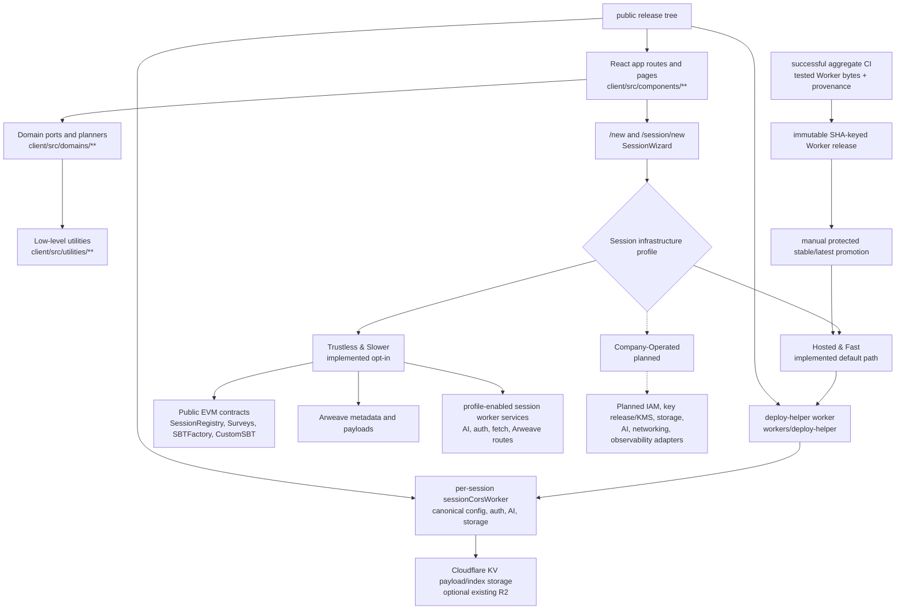

# Architecture Overview

Start here when reviewing the repo for runtime boundaries, deployment surfaces,
and verification gates. This document links the source-of-truth docs instead of
duplicating their full detail.

## Client Boundary Model

The client follows the boundary accepted in
`docs/adr/0001-client-domain-boundaries.md`:

```text
route/page UI
  -> page-owned runtime wiring when needed
  -> purpose-specific ports and planners in client/src/domains/**
  -> low-level utilities in client/src/utilities/**
```

Route and page components should not import concrete low-level Web3, Arweave,
worker, or storage utilities directly. Domain ports may import low-level modules
and must preserve call-time object lookup where tests spy on object-style modules
such as `contractScripts`.



Static app hosting, public/private session access, and the session
infrastructure profile are independent choices. The `/new` screen does not
automatically preselect a hosting option; `Fast & Cheap (Cloudflare)` is the implemented
default/recommended path once chosen, and
`Trustless & Public (Decentralized)` is the implemented opt-in path. The
Company-Operated branch is a planned adapter architecture, not a shipped
corporate package. It can target entirely off-chain infrastructure; a private
EVM would be only a possible future adapter, never a requirement.

Primary source entry points are `client/src/components/MainSite/AppShell.tsx`,
`client/src/components/SurveyTool/SurveyTool.tsx`,
`client/src/components/Sessions/SessionWizard.tsx`, and
`client/src/components/Admin/AdminPage.tsx`.

## Query Layer

The client has one shared TanStack Query client at
`client/src/app/runtime/appQueryClient.tsx`. It is the same instance as
`wagmiClient.queryClient`; creating another `QueryClient` is not allowed.
wagmi 0.9 provides that instance through a private React context, so App also
mounts a default `QueryClientProvider` with the same instance for application
queries. There are two provider contexts but only one client and one cache.
Hook modules consume that client with TanStack's `useQueryClient()` context and
must not import `appQueryClient.tsx`; only the app bootstrap and its identity
test import the foundation module. This keeps wagmi's ESM bundle and its
module-scope `configureChains`/`createClient` side effects out of unrelated
component and test import graphs.

Application query hooks belong between components and domain ports:

```text
route/page UI
  -> query hook (cache, loading state, invalidation)
  -> client/src/domains/** read port
  -> low-level utility
```

Query functions must call domain read ports rather than importing low-level
Web3, Arweave, worker, or storage utilities directly. Existing IndexedDB and
localStorage caches remain authoritative persistence. wagmi 0.9 installs its
React Query persistence plugin on the shared client, so every application key
starts with `{ scope: 'ce-app', persist: false }` to opt out of `wagmi.cache`.
Old string-first application entries no longer match and age out naturally.

Keys use the `queryKeys` factory, which the app foundation also exposes for
bootstrap consumers. After the frozen application scope object, a
scoped key has fixed slots
`[appScope, domain, entity, chainId, sessionSlug, address, ...ids]`; absent scope values
are `null`, addresses are normalized to lowercase, and object-valued IDs are
rejected. The remaining fixed scalar slots keep equality independent of input
object identity.

The application layer inherits wagmi 0.9's query defaults: a 24-hour
`cacheTime`, zero retries, `refetchOnWindowFocus: false`, and
`networkMode: 'offlineFirst'`. Read families override freshness only when their
existing behavior requires it.

Freshness is mapped per read family from current behavior, never invented:

| Existing behavior | Query v4 mapping |
| --- | --- |
| Explicit TTL | Preserve it as `staleTime`; retain data with `cacheTime` according to the same lifecycle. |
| Cache-revision or event driven | Use `staleTime: Infinity`; the existing event and successful write paths explicitly invalidate the affected key. |
| User-triggered refresh | Keep the refresh control and invalidate or refetch the exact key. |

TanStack Query v5 renames `cacheTime` to `gcTime`; dependency migration is a
separate change and must not alter these semantics.

The first functional exemplar is TagPage's session-registry snapshot. It reads
through the session-registry domain port, uses synchronous `initialData` to
preserve the previous first render, and keeps `staleTime: Infinity`. The
app query provider owns one app-lifetime subscription that maps the existing
session-registry cache-update event to the
`[appScope, 'sessions', 'registry']` key family. This keeps inactive queries
marked stale so they refetch on the next mount, without adding a duplicate
subscription for each mounted consumer.
Successful cache loads and upserts already emit that event. Fetch/upsert
orchestration remains outside the read hook. Its characterized mount reads
decreased from three to two.

The event-driven invalidation recipe is:

1. Key the projection with the shared query key factory.
2. Register one app-lifetime subscription per shared query client for the
   existing cache or revision event, with cleanup owned by its provider.
3. Invalidate the narrow domain/entity key family on that event; read hooks do
   not register duplicate listeners.
4. Keep write completion responsible only for emitting the existing signal.

Each migration slice must:

1. Characterize loading, data shape, context changes, freshness, and fetch count.
2. Add a hook over an existing domain read port using the shared key factory.
3. Convert one named functional surface without changing routes, test IDs, copy,
   payloads, storage keys, or write behavior.
4. Wire existing events and successful writes to exact-key invalidation.
5. Prove duplicate in-flight reads are collapsed and fetch counts do not rise.

## Enforcement System

The tracked checks work together:

- `npm run client-boundaries:check` runs
  `scripts/check-client-boundaries.mjs` and the zero-entry boundary baseline.
- `npm run type-debt:check` runs `scripts/check-type-debt-ratchet.mjs` against
  `scripts/type-debt-baseline.json`.
- CI runs baseline monotonicity in `.github/workflows/ci.yml`; baselines may
  shrink or stay flat unless an intentional rollout explicitly allows growth.
- `npm run verify:public-release-surface` prevents public files from importing
  stripped private paths.
- Public release export checks retained Markdown for private references,
  unavailable npm commands, and broken local links.
- `npm run test:wiring` verifies test inventory, boundary checks, and text
  hygiene.
- `scripts/ci-gates.json` defines the serial local CI profile, the split hosted
  gate set, and the standalone release profile. `test:ci` and GitHub Actions
  consume the same named gates; `verify:release` runs its narrower release
  profile without being nested in local CI.

## Worker Topology

The worker surface is documented in `docs/session-cors-worker.md`.

- `workers/sessionCorsWorker/` is the session worker. It handles AI proxying,
  transcription, Arweave uploads, storage routes, fetch helpers, auth, gates,
  faucet support, and sponsored/deploy-helper paths.
- In the default `Fast & Cheap (Cloudflare)` profile, a creator-owned
  per-session instance is the canonical config, auth, and payload-storage
  authority. Its passkey-derived admin EOA signs config without submitting an
  EVM transaction.
- `workers/deploy-helper/` is a separate helper worker used by `/new` and
  self-hosted deployments to call Cloudflare APIs, create the target worker and
  KV namespace, and seed initial session config/secrets.
- `scripts/worker-bundle.mjs` bundles `sessionCorsWorker` and `deploy-helper`
  into `dist/`; `scripts/verify-worker-bundle-sync.mjs` verifies those bundles
  are in sync with source.

Auth decisions:

- `docs/adr/0002-worker-auth-revalidation.md` records 4-hour login tokens with
  `jti` markers in KV and fail-closed marker checks for authenticated routes.
- `docs/adr/0004-worker-auth-consistency-risk-acceptance.md` accepts the
  remaining cross-isolate KV consistency limits for nonce and rate-limit state.

## Storage Model

Storage authority follows the selected profile:

- Hosted & Fast uses the session worker's Cloudflare bindings for canonical
  config, encrypted payload envelopes, and indexes. KV-only payload storage is
  the default-compatible path; binding an existing R2 bucket is an explicit
  advanced option.
- Trustless & Slower keeps Arweave as its durable metadata and payload store,
  with public EVM contracts anchoring the selected registry and gate state.
- Company-Operated targets organization-selected storage adapters and does not
  require Arweave or EVM storage.

The session worker exposes the profile-aware canonical storage routes:

- `POST /storage/upload`
- `GET|POST /storage/read`
- `GET|POST /storage/list`

`docs/session-cors-worker.md` describes how those routes map to Cloudflare or
Arweave storage, worker envelopes, and gated access checks.

## Contracts And Chains

For Trustless & Slower and custom chain-backed profiles, the canonical Solidity
contracts live in `contracts/`, with deploy scripts in `foundry/script/` and
tests in `foundry/test/`:

- `SessionRegistry.sol` stores session identity, metadata pointers, admins,
  worker URLs, sponsored flags, and resource gates.
- `Surveys.sol` anchors question and response hashes.
- `CustomSBT.sol` implements the non-transferable SBT token.
- `SBTFactory.sol` deploys session/group SBT contracts.

The client reads ABIs from `client/src/contractsABI/`. Checked-in chain-profile
fallbacks live in `client/src/variables/chains.ts` and
`client/src/variables/contracts.json`; OP Sepolia (`11155420`) is the default
chain fallback when a profile selects EVM behavior, while Base Sepolia
(`84532`) remains a compatibility chain. Neither chain is required by the
default worker-canonical profile.

## Release And Public Surface

The release build creates a curated source tree and validates both code imports
and retained Markdown before publication. Public source must not depend on files
that are absent from that tree.

## E2E Harness

The public smoke runner is `npm run test:e2e`, backed by the Vite navigation and
route-style smoke. Broader workflow validation is maintained separately from the
published source package.
