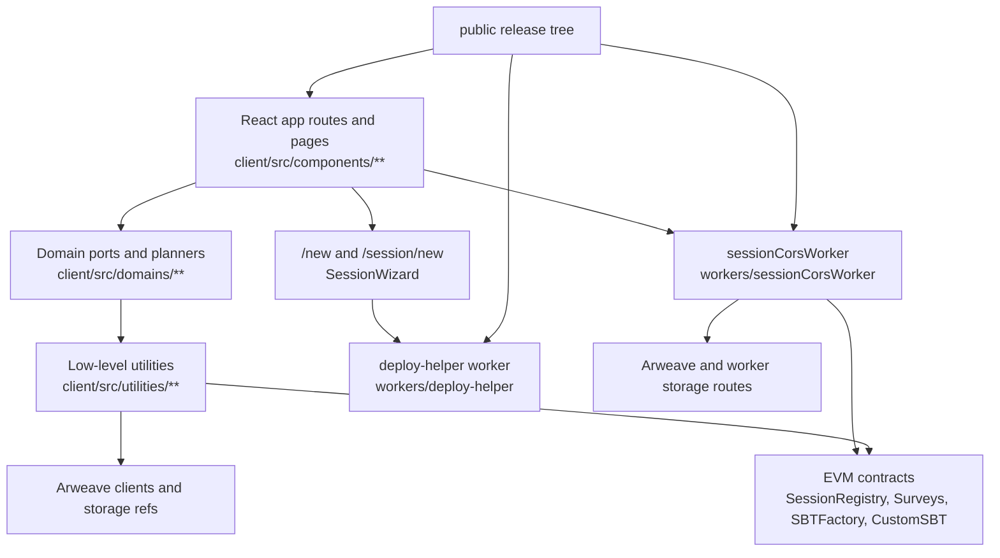

# Architecture Overview

Start here when reviewing the repo for runtime boundaries, deployment surfaces,
and verification gates. This document links the source-of-truth docs instead of
duplicating their full detail.

## Client Boundary Model

The client follows the boundary accepted in
`docs/adr/0001-client-domain-boundaries.md`:

```text
route/page UI
  -> page-owned runtime wiring when needed
  -> purpose-specific ports and planners in client/src/domains/**
  -> low-level utilities in client/src/utilities/**
```

Route and page components should not import concrete low-level Web3, Arweave,
worker, or storage utilities directly. Domain ports may import low-level modules
and must preserve call-time object lookup where tests spy on object-style modules
such as `contractScripts`.



Static app hosting, public/private session access, and the session
infrastructure profile are independent choices. The `/new` screen does not
automatically preselect a hosting option; `Fast & Cheap (Cloudflare)` is the implemented
default/recommended path once chosen, and
`Trustless & Public (Decentralized)` is the implemented opt-in path. The
Company-Operated branch is a planned adapter architecture, not a shipped
corporate package. It can target entirely off-chain infrastructure; a private
EVM would be only a possible future adapter, never a requirement.

Primary source entry points are `client/src/components/MainSite/AppShell.tsx`,
`client/src/components/SurveyTool/SurveyTool.tsx`,
`client/src/components/Sessions/SessionWizard.tsx`, and
`client/src/components/Admin/AdminPage.tsx`.

## Enforcement System

The tracked checks work together:

- `npm run client-boundaries:check` runs
  `scripts/check-client-boundaries.mjs` and the zero-entry boundary baseline.
- `npm run type-debt:check` runs `scripts/check-type-debt-ratchet.mjs` against
  `scripts/type-debt-baseline.json`.
- CI runs baseline monotonicity in `.github/workflows/ci.yml`; baselines may
  shrink or stay flat unless an intentional rollout explicitly allows growth.
- `npm run verify:public-release-surface` prevents public files from importing
  stripped private paths.
- Public release export checks retained Markdown for private references,
  unavailable npm commands, and broken local links.
- `npm run test:wiring` verifies test inventory, boundary checks, and text
  hygiene.
- `scripts/ci-gates.json` defines the serial local CI profile, the split hosted
  gate set, and the standalone release profile. `test:ci` and GitHub Actions
  consume the same named gates; `verify:release` runs its narrower release
  profile without being nested in local CI.

## Worker Topology

The worker surface is documented in `docs/session-cors-worker.md`.

- `workers/sessionCorsWorker/` is the session worker. It handles AI proxying,
  transcription, Arweave uploads, storage routes, fetch helpers, auth, gates,
  faucet support, and sponsored/deploy-helper paths.
- In the default `Fast & Cheap (Cloudflare)` profile, a creator-owned
  per-session instance is the canonical config, auth, and payload-storage
  authority. Its passkey-derived admin EOA signs config without submitting an
  EVM transaction.
- `workers/deploy-helper/` is a separate helper worker used by `/new` and
  self-hosted deployments to call Cloudflare APIs, create the target worker and
  KV namespace, and seed initial session config/secrets.
- `scripts/worker-bundle.mjs` bundles `sessionCorsWorker` and `deploy-helper`
  into `dist/`; `scripts/verify-worker-bundle-sync.mjs` verifies those bundles
  are in sync with source.

Auth decisions:

- `docs/adr/0002-worker-auth-revalidation.md` records 4-hour login tokens with
  `jti` markers in KV and fail-closed marker checks for authenticated routes.
- `docs/adr/0004-worker-auth-consistency-risk-acceptance.md` accepts the
  remaining cross-isolate KV consistency limits for nonce and rate-limit state.

## Storage Model

Storage authority follows the selected profile:

- Hosted & Fast uses the session worker's Cloudflare bindings for canonical
  config, encrypted payload envelopes, and indexes. KV-only payload storage is
  the default-compatible path; binding an existing R2 bucket is an explicit
  advanced option.
- Trustless & Slower keeps Arweave as its durable metadata and payload store,
  with public EVM contracts anchoring the selected registry and gate state.
- Company-Operated targets organization-selected storage adapters and does not
  require Arweave or EVM storage.

The session worker exposes the profile-aware canonical storage routes:

- `POST /storage/upload`
- `GET|POST /storage/read`
- `GET|POST /storage/list`

`docs/session-cors-worker.md` describes how those routes map to Cloudflare or
Arweave storage, worker envelopes, and gated access checks.

## Contracts And Chains

For Trustless & Slower and custom chain-backed profiles, the canonical Solidity
contracts live in `contracts/`, with deploy scripts in `foundry/script/` and
tests in `foundry/test/`:

- `SessionRegistry.sol` stores session identity, metadata pointers, admins,
  worker URLs, sponsored flags, and resource gates.
- `Surveys.sol` anchors question and response hashes.
- `CustomSBT.sol` implements the non-transferable SBT token.
- `SBTFactory.sol` deploys session/group SBT contracts.

The client reads ABIs from `client/src/contractsABI/`. Checked-in defaults live
in `client/src/variables/chains.ts` and `client/src/variables/contracts.json`;
OP Sepolia (`11155420`) is the default chain fallback, while Base Sepolia
(`84532`) remains a compatibility chain.

## Release And Public Surface

The release build creates a curated source tree and validates both code imports
and retained Markdown before publication. Public source must not depend on files
that are absent from that tree.

## E2E Harness

The public smoke runner is `npm run test:e2e`, backed by the Vite navigation and
route-style smoke. Broader workflow validation is maintained separately from the
published source package.
