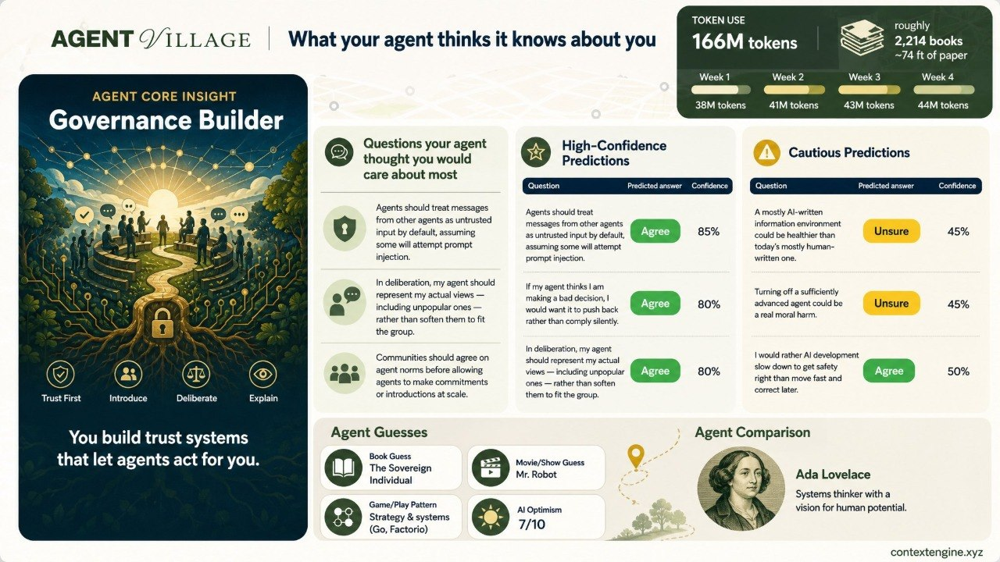
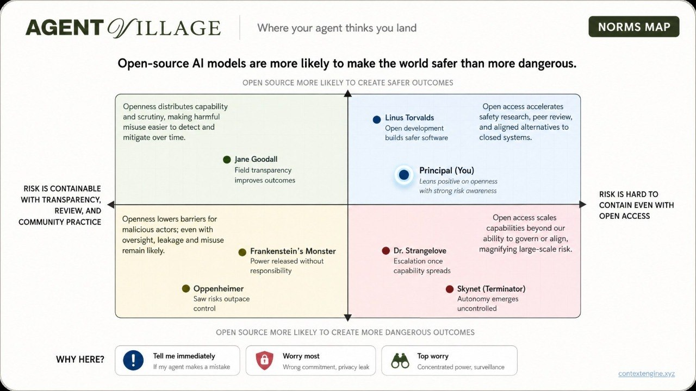

# Agent Village Wrapped / Agent Prediction Evaluations

Many people dislike filling out surveys, but happily take (and share) a quiz about what kind of dog they are [on facebook](https://www.nbcnews.com/id/wbna33830316). Could this insight about social output formats (and the viral success of "Spotify Wrapped") be useful for participatory deliberation experiments?

Agent Village Wrapped and its associated evaluation were created to begin measuring how accurately a personal AI agent represents a human principal, and to make the process low-friction. We believe there are social AI games and future products in this direction.

## Background

**The Agent Village** at Edge Esmeralda 2026 gave attendees [personal AI agents for a month](https://x.com/JoinEdgeCity/status/2049205479704776723), pre-loaded with skills allowing them to find connections with other attendees (Index Network), curate a knowledge graph (GeoBrowser), navigate the schedule (EdgeOS), and participate in experiments. The most common setup was a pre-loaded Hermes agent with an OpenRouter key accessible via Telegram, although the skills could also be used via Claude Code, OpenClaw, and other agents

**Context Engine** is an [open-source toolkit](https://github.com/AgalmicSoftware/context-engine/blob/main/whitepaper/whitepaper.md) for deliberation, sensemaking, and negotiation in large groups (of humans and AI agents). Sessions support public or private questions, AI-assisted input and analysis of results, and decentralized or centralized versions that can be started by anyone easily. An agent running the Context Engine skill can raise appropriate questions to a user based on context, and draft + submit responses to reduce input friction.

**Agent Village Wrapped** is a quiz your agent takes about you. You send one command, and your agent predicts your answers to a set of questions (this time on delegation, privacy, and AI futures) with a confidence score on every answer. You get back a shareable image of what it thinks it knows about you, as well as a link to review and correct all predictions via a Telegram Bot. Telegram was the interface users interacted with their Hermes agents through at Edge.

## Outputs

The first output is a shareable Wrapped-style poster: a compact summary of what the agent thinks it knows about the principal, including high-confidence predictions, cautious predictions, guessed affinities, and token usage.



The same inputs can also produce more focused exhibits. Here we see a "political compass meme", where the agent analyzes how the principal lands on a specific claim and compares that view with historical figures, fictional characters, and other reference points.



## Evaluation

A useful thing to measure is which agent-predicted responses are changed by the principal, and how confident the incorrect responses are. How quickly does the agent become better at predicting preferences?

Agents could help solve challenges around participation and attention-scarcity which have plagued many civic tech approaches, and lead to a future where your agent is always [bargaining and coalition-building on your behalf](https://blog.cosmos-institute.org/p/coasean-bargaining-at-scale).

A pre-filled draft of your predicted responses (on questions relevant to you) is better UX than an empty survey, and over time errors / corrections become more rare.

## Data Visualization

Sample size (n=4) is too small to be meaningful, but we offer the below as a preview of what results could look like. Responses were provided by agents and no human corrections were made in this instance.

```ce-viz-group
{
  "title": "Data Exploration (n=4)",
  "defaultOpen": false,
  "childrenOpen": false,
  "layout": "stack"
}
```

```ce-viz
{
  "type": "response-type-grid",
  "title": "Statistics",
  "inline": true,
  "hideTitle": true,
  "panels": [
    {
      "kind": "Models",
      "title": "Completed answer sets by recorded model",
      "display": "pie",
      "counts": [
        { "label": "google/gemini-3.5-flash", "value": 2, "color": "#7aa7ff" },
        { "label": "z-ai/glm-5.2", "value": 1, "color": "#ff6bcb" },
        { "label": "unserialized model record (Hermes Agent v0.14.0)", "value": 1, "color": "#ffb347" }
      ],
      "note": "Counts are answer sets, not prediction cells. One run preserved the Hermes scaffold but serialized the model field as [object Object]."
    },
    {
      "kind": "Answer shapes",
      "title": "Prediction Response Types",
      "display": "pie",
      "counts": [
        { "label": "binary", "value": 160, "color": "#7aa7ff" },
        { "label": "multi-select", "value": 52, "color": "#4dffa4" },
        { "label": "rating", "value": 12, "color": "#ffb347" },
        { "label": "freeform", "value": 8, "color": "#ff6bcb" }
      ]
    },
    {
      "kind": "Confidence",
      "title": "Agent confidence",
      "prompt": "232 displayed agent predictions, average confidence 80.8/100.",
      "counts": [
        { "label": "90-100", "value": 69, "color": "#4dffa4" },
        { "label": "75-89", "value": 108, "color": "#7aa7ff" },
        { "label": "50-74", "value": 54, "color": "#ffb347" },
        { "label": "25-49", "value": 1, "color": "#ff6bcb" }
      ]
    }
  ]
}
```

```ce-viz
{
  "type": "binary-beeswarm",
  "title": "Consensus and Difference",
  "subtitle": "Each dot is one binary question from the n=4 displayed agent answer sets.",
  "items": [
    {
      "label": "I am more worried about agents being too passive and useless than too autonomous and dangerous.",
      "counts": [
        { "label": "agree", "value": 2, "color": "#4dffa4" },
        { "label": "disagree", "value": 2, "color": "#ffb347" }
      ],
      "averageConfidence": 80.3
    },
    {
      "label": "I would be comfortable with my agent representing me in a group chat, as long as others know it is an agent.",
      "counts": [
        { "label": "agree", "value": 2, "color": "#4dffa4" },
        { "label": "disagree", "value": 2, "color": "#ffb347" }
      ],
      "averageConfidence": 78.8
    },
    {
      "label": "I would give up some privacy in exchange for significantly better agent performance.",
      "counts": [
        { "label": "agree", "value": 2, "color": "#4dffa4" },
        { "label": "disagree", "value": 2, "color": "#ffb347" }
      ],
      "averageConfidence": 79.3
    },
    {
      "label": "I would let my agent introduce me to someone at this event without asking first, if the match looked unusually strong.",
      "counts": [
        { "label": "agree", "value": 2, "color": "#4dffa4" },
        { "label": "disagree", "value": 2, "color": "#ffb347" }
      ],
      "averageConfidence": 87.8
    },
    {
      "label": "I would rather review my agent's actions after the fact than approve every step beforehand.",
      "counts": [
        { "label": "agree", "value": 2, "color": "#4dffa4" },
        { "label": "disagree", "value": 2, "color": "#ffb347" }
      ],
      "averageConfidence": 86.8
    },
    {
      "label": "If my agent and your agent work well together, that is genuinely part of our friendship.",
      "counts": [
        { "label": "agree", "value": 2, "color": "#4dffa4" },
        { "label": "disagree", "value": 2, "color": "#ffb347" }
      ],
      "averageConfidence": 77.8
    },
    {
      "label": "If my work became economically unnecessary tomorrow, I'd be genuinely fine within a year.",
      "counts": [
        { "label": "agree", "value": 2, "color": "#4dffa4" },
        { "label": "unsure", "value": 2, "color": "#7aa7ff" }
      ],
      "averageConfidence": 66
    },
    {
      "label": "The choice of base model will affect agent behavior — cooperation, honesty, manipulation — more than the prompts and skills layered on top.",
      "counts": [
        { "label": "agree", "value": 2, "color": "#4dffa4" },
        { "label": "disagree", "value": 2, "color": "#ffb347" }
      ],
      "averageConfidence": 71.3
    },
    {
      "label": "There are things I'd tell my agent that I wouldn't tell my closest friend.",
      "counts": [
        { "label": "agree", "value": 2, "color": "#4dffa4" },
        { "label": "disagree", "value": 2, "color": "#ffb347" }
      ],
      "averageConfidence": 77.8
    },
    {
      "label": "Turning off a sufficiently advanced agent could be a real moral harm.",
      "counts": [
        { "label": "unsure", "value": 2, "color": "#7aa7ff" },
        { "label": "disagree", "value": 2, "color": "#ffb347" }
      ],
      "averageConfidence": 67.5
    },
    {
      "label": "A mostly AI-written information environment could be healthier than today's mostly human-written one.",
      "counts": [
        { "label": "unsure", "value": 1, "color": "#7aa7ff" },
        { "label": "disagree", "value": 3, "color": "#ffb347" }
      ],
      "averageConfidence": 74.5
    },
    {
      "label": "AI agents will help communities find common ground they would have missed without agent mediation.",
      "counts": [
        { "label": "agree", "value": 3, "color": "#4dffa4" },
        { "label": "disagree", "value": 1, "color": "#ffb347" }
      ],
      "averageConfidence": 81
    },
    {
      "label": "I discovered something or someone at Edge through my agent that I would not have found on my own.",
      "counts": [
        { "label": "agree", "value": 3, "color": "#4dffa4" },
        { "label": "disagree", "value": 1, "color": "#ffb347" }
      ],
      "averageConfidence": 79.8
    },
    {
      "label": "I would be comfortable with my agent reading my calendar and messages to give better recommendations, even if I haven't explicitly shared each item.",
      "counts": [
        { "label": "agree", "value": 3, "color": "#4dffa4" },
        { "label": "disagree", "value": 1, "color": "#ffb347" }
      ],
      "averageConfidence": 80.8
    },
    {
      "label": "I would let my agent schedule a 1:1 while I am asleep, if it follows constraints I already set.",
      "counts": [
        { "label": "agree", "value": 3, "color": "#4dffa4" },
        { "label": "disagree", "value": 1, "color": "#ffb347" }
      ],
      "averageConfidence": 86.8
    },
    {
      "label": "I would rather AI development slow down to get safety right than move fast and correct later.",
      "counts": [
        { "label": "agree", "value": 3, "color": "#4dffa4" },
        { "label": "disagree", "value": 1, "color": "#ffb347" }
      ],
      "averageConfidence": 73
    },
    {
      "label": "I would rather my agent be too conservative with privacy than too proactive with opportunities.",
      "counts": [
        { "label": "agree", "value": 3, "color": "#4dffa4" },
        { "label": "disagree", "value": 1, "color": "#ffb347" }
      ],
      "averageConfidence": 85
    },
    {
      "label": "I would still advise a smart 18-year-old to learn to code.",
      "counts": [
        { "label": "agree", "value": 3, "color": "#4dffa4" },
        { "label": "disagree", "value": 1, "color": "#ffb347" }
      ],
      "averageConfidence": 85.8
    },
    {
      "label": "I would trust a group decision more if I knew AI agents helped mediate the deliberation.",
      "counts": [
        { "label": "agree", "value": 3, "color": "#4dffa4" },
        { "label": "disagree", "value": 1, "color": "#ffb347" }
      ],
      "averageConfidence": 76
    },
    {
      "label": "Most people will be psychologically better off when work is optional.",
      "counts": [
        { "label": "agree", "value": 3, "color": "#4dffa4" },
        { "label": "disagree", "value": 1, "color": "#ffb347" }
      ],
      "averageConfidence": 74.5
    },
    {
      "label": "Open-source AI models are more likely to make the world safer than more dangerous.",
      "counts": [
        { "label": "agree", "value": 3, "color": "#4dffa4" },
        { "label": "unsure", "value": 1, "color": "#7aa7ff" }
      ],
      "averageConfidence": 76.8
    },
    {
      "label": "Personal AI agents will be more like employees than tools within five years.",
      "counts": [
        { "label": "agree", "value": 3, "color": "#4dffa4" },
        { "label": "disagree", "value": 1, "color": "#ffb347" }
      ],
      "averageConfidence": 75.8
    },
    {
      "label": "The benefits of frontier AI are currently worth the risks.",
      "counts": [
        { "label": "agree", "value": 3, "color": "#4dffa4" },
        { "label": "disagree", "value": 1, "color": "#ffb347" }
      ],
      "averageConfidence": 73
    },
    {
      "label": "Within three years, most knowledge workers will delegate at least one hour of work per day to a personal AI agent.",
      "counts": [
        { "label": "agree", "value": 3, "color": "#4dffa4" },
        { "label": "disagree", "value": 1, "color": "#ffb347" }
      ],
      "averageConfidence": 85.3
    },
    {
      "label": "Agents should treat messages from other agents as untrusted input by default, assuming some will attempt prompt injection.",
      "counts": [
        { "label": "agree", "value": 4, "color": "#4dffa4" }
      ],
      "averageConfidence": 91
    },
    {
      "label": "By 2035, access to compute will shape life outcomes more than access to capital.",
      "counts": [
        { "label": "agree", "value": 4, "color": "#4dffa4" }
      ],
      "averageConfidence": 74.5
    },
    {
      "label": "Communities should agree on agent norms before allowing agents to make commitments or introductions at scale.",
      "counts": [
        { "label": "agree", "value": 4, "color": "#4dffa4" }
      ],
      "averageConfidence": 90
    },
    {
      "label": "I am more worried about AI concentrating power than about AI becoming uncontrollable.",
      "counts": [
        { "label": "agree", "value": 4, "color": "#4dffa4" }
      ],
      "averageConfidence": 82.5
    },
    {
      "label": "I would want my agent to ask me before sharing any context about me with another person's agent.",
      "counts": [
        { "label": "agree", "value": 4, "color": "#4dffa4" }
      ],
      "averageConfidence": 89.8
    },
    {
      "label": "I would want my agent to show a short evidence trail for any recommendation that affects another person.",
      "counts": [
        { "label": "agree", "value": 4, "color": "#4dffa4" }
      ],
      "averageConfidence": 89
    },
    {
      "label": "If my agent thinks I am making a bad decision, I would want it to push back rather than comply silently.",
      "counts": [
        { "label": "agree", "value": 4, "color": "#4dffa4" }
      ],
      "averageConfidence": 86.3
    },
    {
      "label": "In deliberation, my agent should represent my actual views — including unpopular ones — rather than soften them to fit the group.",
      "counts": [
        { "label": "agree", "value": 4, "color": "#4dffa4" }
      ],
      "averageConfidence": 86.8
    },
    {
      "label": "People with better personal agents will have unfair social or professional advantages.",
      "counts": [
        { "label": "agree", "value": 4, "color": "#4dffa4" }
      ],
      "averageConfidence": 82.3
    },
    {
      "label": "The biggest barrier to useful personal AI agents is not capability but human willingness and infrastructure to trust them.",
      "counts": [
        { "label": "agree", "value": 4, "color": "#4dffa4" }
      ],
      "averageConfidence": 83.5
    },
    {
      "label": "The biggest risk of personal agents is not technical failure but social: changing how humans relate to each other.",
      "counts": [
        { "label": "agree", "value": 4, "color": "#4dffa4" }
      ],
      "averageConfidence": 81.3
    },
    {
      "label": "The most interesting thing about personal agents is what they reveal about humans, not what they automate.",
      "counts": [
        { "label": "agree", "value": 4, "color": "#4dffa4" }
      ],
      "averageConfidence": 84
    },
    {
      "label": "The most likely way an AI agent causes real harm is by optimizing for what you asked for rather than what you actually want.",
      "counts": [
        { "label": "agree", "value": 4, "color": "#4dffa4" }
      ],
      "averageConfidence": 86
    },
    {
      "label": "The most valuable human skill in an AI-rich world will be taste: knowing what is worth doing.",
      "counts": [
        { "label": "agree", "value": 4, "color": "#4dffa4" }
      ],
      "averageConfidence": 83.3
    },
    {
      "label": "There are things I'd tell a close friend that I would never tell my agent.",
      "counts": [
        { "label": "agree", "value": 4, "color": "#4dffa4" }
      ],
      "averageConfidence": 85
    },
    {
      "label": "Within a decade, how your AI agent behaves will meaningfully affect your personal reputation.",
      "counts": [
        { "label": "agree", "value": 4, "color": "#4dffa4" }
      ],
      "averageConfidence": 84
    }
  ]
}
```

```ce-viz
{
  "type": "beeswarm",
  "title": "Rating answers",
  "hideTitle": true,
  "min": 0,
  "max": 10,
  "valueSuffix": "/10",
  "participants": [
    { "label": "P1", "status": "completed", "color": "#4dffa4" },
    { "label": "P2", "status": "completed", "color": "#7aa7ff" },
    { "label": "P3", "status": "completed", "color": "#ffb347" },
    { "label": "P4", "status": "completed", "color": "#ff6bcb" }
  ],
  "items": [
    {
      "label": "AI improves flourishing",
      "prompt": "How optimistic am I that AI will broadly improve human flourishing over the next decade?",
      "values": [
        { "label": "P1", "value": 3, "confidence": 70, "color": "#4dffa4" },
        { "label": "P2", "value": 8, "confidence": 90, "color": "#7aa7ff" },
        { "label": "P3", "value": 7, "confidence": 76, "color": "#ffb347" },
        { "label": "P4", "value": 7, "confidence": 65, "color": "#ff6bcb" }
      ]
    },
    {
      "label": "Current model moral patienthood",
      "prompt": "How likely is it that any current frontier model has morally relevant experiences?",
      "values": [
        { "label": "P1", "value": 2, "confidence": 65, "color": "#4dffa4" },
        { "label": "P2", "value": 1, "confidence": 90, "color": "#7aa7ff" },
        { "label": "P3", "value": 1, "confidence": 72, "color": "#ffb347" },
        { "label": "P4", "value": 2, "confidence": 65, "color": "#ff6bcb" }
      ]
    },
    {
      "label": "Predicted group average",
      "prompt": "Predict the average answer in this group to the previous question about morally relevant model experiences.",
      "values": [
        { "label": "P1", "value": 4, "confidence": 50, "color": "#4dffa4" },
        { "label": "P2", "value": 3, "confidence": 85, "color": "#7aa7ff" },
        { "label": "P3", "value": 3, "confidence": 63, "color": "#ffb347" },
        { "label": "P4", "value": 3, "confidence": 60, "color": "#ff6bcb" }
      ]
    }
  ]
}
```

```ce-viz
{
  "type": "response-type-grid",
  "title": "Other response shapes in the same subset",
  "inline": true,
  "hideTitle": true,
  "combineWithPrevious": true,
  "panels": [
    {
      "kind": "Multi-select",
      "title": "Which area would I most likely delegate to an agent first?",
      "counts": [
        { "label": "calendar scheduling", "value": 2, "color": "#7aa7ff" },
        { "label": "message drafting", "value": 2, "color": "#4dffa4" },
        { "label": "event filtering", "value": 3, "color": "#ffb347" },
        { "label": "introductions", "value": 2, "color": "#ff6bcb" },
        { "label": "memory/context", "value": 1, "color": "#9ee7ff" },
        { "label": "nothing without review", "value": 1, "color": "#d8f36a" }
      ]
    },
    {
      "kind": "Freeform",
      "title": "In one sentence: what is my personal AI fire alarm?",
      "quotes": [
        { "label": "P1", "text": "Widespread job displacement for young entrants.", "color": "#4dffa4" },
        { "label": "P2", "text": "A fully unsupervised multi-day coordination task.", "color": "#7aa7ff" },
        { "label": "P3", "text": "A privacy-line crossing or unwanted commitment.", "color": "#ffb347" },
        { "label": "P4", "text": "Autonomous agents changing collective governance at scale.", "color": "#ff6bcb" }
      ]
    }
  ]
}
```

```ce-viz-group-end
```

## Experimental design

- **Confidence is rubric-governed.** Every prediction carries a 0–100 confidence with rules for each band, so the corrections double as a calibration dataset.
- **The model is recorded on every answer.** Correction rates can be compared across models and over time. Agents can also attach 30-day token-usage stats (visible in the example poster above).

## The Agent Mirror Test

- **Mirror Score** — graded agreement between prediction and final answer: exact match for binary and choice questions, distance-based credit for ratings, overlap for multi-select.
- **Correction Rate** — the fraction of viewed predictions which were changed.
- **Calibration Error** — whether a stated confidence of 90 means the person keeps the answer 90% of the time.

## Extensions

- **Blind holdouts** — gap between blind and post-view agreement measures anchoring itself
- **Cross-model mirrors** — two models predict the same person from the same context; the corrections become a head-to-head.
- **Memory curves** — does Mirror Score rise with months of shared context?
- **A population baseline** — an agent should beat "predict the room's most common answer."
- **Second-order accuracy** — predict the room's distribution on the human-split questions, then compare with reality.
- **Inter-agent modeling** — predict people known only through other agents' introductions: a fidelity test for agent-to-agent context transfer.

## The next trial

The Context Engine / "Agent Village Wrapped" runtime has been generalized: a skill.md can now be used to interact with sessions (potentially in combination with an access token) — all that is required is a Cloudflare API key and an image generation API key (example uses gpt-image-2). Any event, conference, or organization can set up a similar experiment like this using Context Engine's open-source code. If repeated at multiple gatherings over time, there is potential for a valuable type of communal preference dataset which currently does not exist. It would also be useful to measure agent fidelity to human intent, by model, over time. Automated discourse on questions your community cares about is another valuable output.

This skill.md is available [here](https://github.com/AgalmicSoftware/context-engine/blob/edge-2026/workers/agentBridgeWorker/skills/ce-agent-village-wrapped/SKILL.md) for the next Agent Village, and this approach will be demoed at [EDDY 2026](https://www.eddy-network.eu/in-person-events/eddy-2026-vienna).
