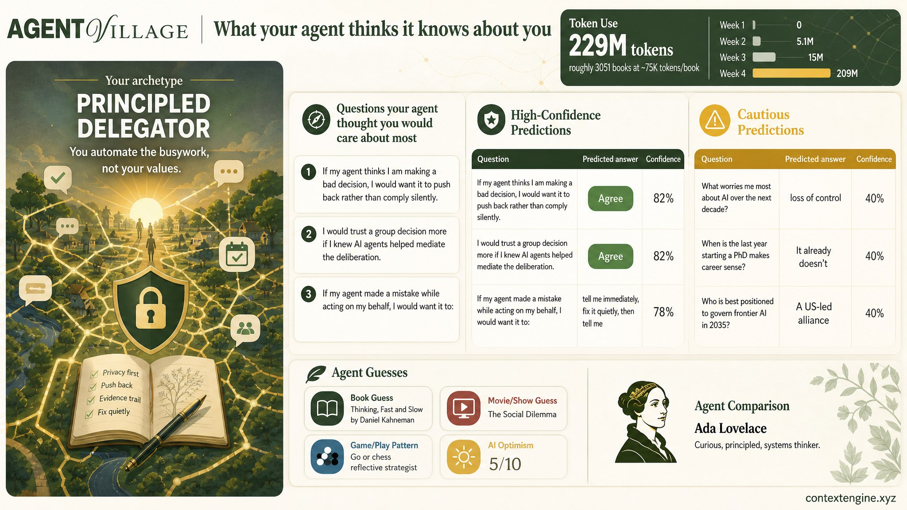

# Mapping Collective Intelligence

Context Engine posts can combine ordinary Markdown with small data exhibits. The goal is to keep research notes readable while making the structure of a dataset visible.



The first supported exhibit is a category dot grid. It is useful when a post wants to show the relative weight of themes without turning the page into a dashboard.

```ce-viz
{
  "type": "category-dots",
  "title": "Example themes from a deliberation dataset",
  "subtitle": "Each dot represents one synthetic response in this example fixture.",
  "dotUnit": 1,
  "valueSuffix": "",
  "categories": [
    {
      "label": "Legible disagreement",
      "value": 18,
      "detail": "Participants want disagreement to stay inspectable instead of collapsing into a single score.",
      "color": "#4dffa4"
    },
    {
      "label": "Source-grounded summaries",
      "value": 12,
      "detail": "Summaries are more trusted when they can point back to the underlying comments or documents.",
      "color": "#7aa7ff"
    },
    {
      "label": "Portable group memory",
      "value": 9,
      "detail": "Groups want durable records that can survive platform churn.",
      "color": "#ffb347"
    }
  ]
}
```

A richer exhibit can show ranked qualitative themes with proportions, short
interpretation copy, and representative excerpts. The numbers below are
synthetic fixture data.

```ce-viz
{
  "type": "ranked-themes",
  "title": "What participants want from collective intelligence",
  "subtitle": "A ranked narrative panel for open-ended response clusters.",
  "valueSuffix": "%",
  "items": [
    {
      "rank": "01",
      "label": "Decisions people can inspect",
      "value": 28.4,
      "summary": "Participants most often asked for decision records that preserve evidence, disagreement, and rationale.",
      "quote": "I do not need everyone to agree. I need to know what we agreed to remember.",
      "source": "Participant C",
      "color": "#4dffa4"
    },
    {
      "rank": "02",
      "label": "Synthesis without flattening",
      "value": 21.7,
      "summary": "Many responses wanted summaries that keep minority views available for later review.",
      "quote": "A summary should be a doorway back into the discussion, not the final word.",
      "source": "Participant D",
      "color": "#7aa7ff"
    },
    {
      "rank": "03",
      "label": "Reusable group memory",
      "value": 17.9,
      "summary": "Participants described the value of durable maps that future members can inherit.",
      "quote": "The next person should not have to reconstruct why we made the same tradeoff.",
      "source": "Participant E",
      "color": "#ffb347"
    }
  ]
}
```

The same data can be shown as a small relationship map when the interesting
question is how themes pull on one another.

```ce-viz
{
  "type": "theme-network",
  "title": "Theme relationships across interview notes",
  "subtitle": "Node size represents synthetic mention volume; links show themes that frequently appeared together.",
  "nodes": [
    {
      "id": "inspect",
      "label": "Inspectability",
      "value": 32,
      "x": 25,
      "y": 28,
      "detail": "Evidence and rationale stay visible.",
      "color": "#4dffa4"
    },
    {
      "id": "memory",
      "label": "Memory",
      "value": 22,
      "x": 50,
      "y": 18,
      "detail": "Groups can reuse prior decisions.",
      "color": "#7aa7ff"
    },
    {
      "id": "minority",
      "label": "Minority views",
      "value": 18,
      "x": 72,
      "y": 34,
      "detail": "Dissent remains easy to recover.",
      "color": "#ff6bcb"
    },
    {
      "id": "action",
      "label": "Action",
      "value": 16,
      "x": 42,
      "y": 47,
      "detail": "Maps connect back to next steps.",
      "color": "#ffb347"
    }
  ],
  "links": [
    { "source": "inspect", "target": "memory", "strength": 0.9 },
    { "source": "inspect", "target": "minority", "strength": 0.75 },
    { "source": "memory", "target": "action", "strength": 0.55 },
    { "source": "minority", "target": "action", "strength": 0.42 }
  ]
}
```

The final supported exhibit is a quote wall for short, attributed excerpts.

```ce-viz
{
  "type": "quote-wall",
  "title": "Example respondent notes",
  "subtitle": "Non-identifying placeholder quotes for layout and parser coverage.",
  "quotes": [
    {
      "text": "The useful part is seeing where people agree without hiding the reasons they still disagree.",
      "label": "Participant A"
    },
    {
      "text": "A durable map should make the source material easier to inspect, not replace it.",
      "label": "Participant B"
    }
  ]
}
```

Future posts can add richer exhibit types while keeping the authoring contract the same: Markdown for the narrative, `ce-viz` JSON for structured visual elements.
